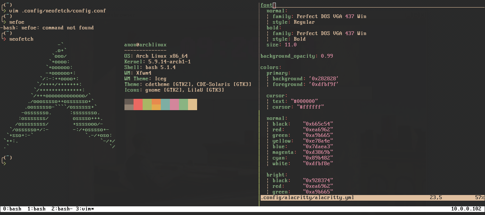
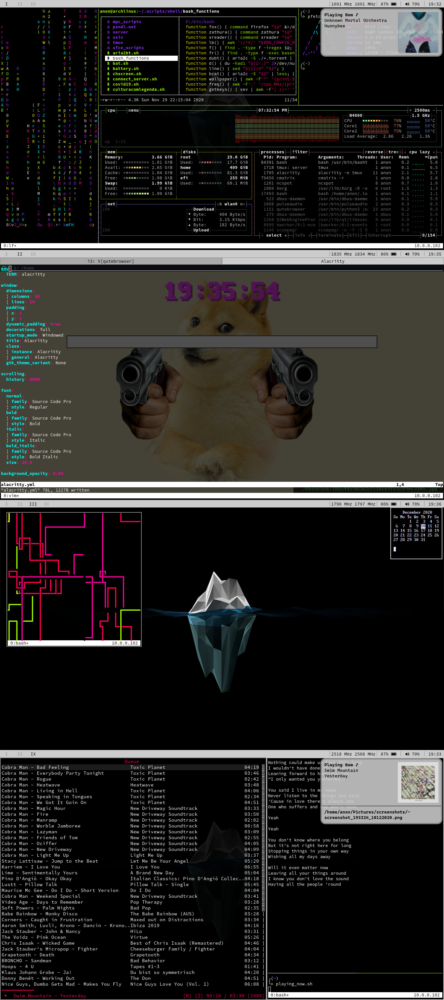

## My dotfiles 
Here you will find my customized and simplified configuration files for my needs and some of the scripts that I use daily that may be useful for you (idk).
I am constantly changing the color schemes of my terminal and i3 configuration, so if you came here because of a screenshot I posted a month ago on [r/unixporn](https://reddit.com/r/unixporn), there is a great chance that you won't find the same theme here.

Current Alacritty color scheme

